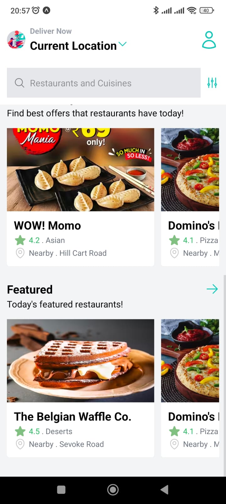
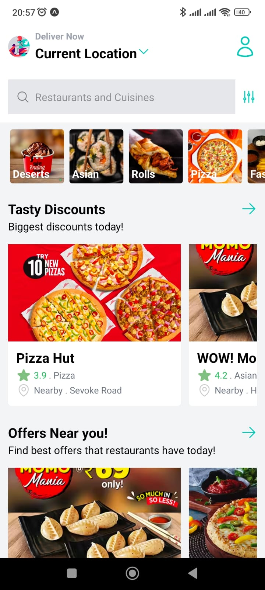
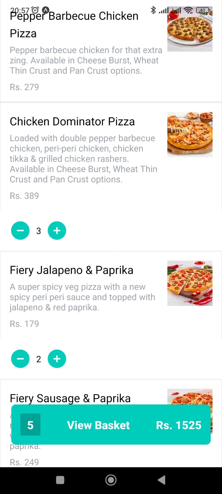
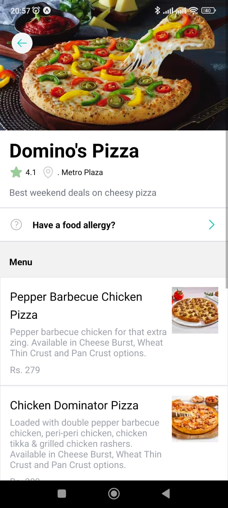
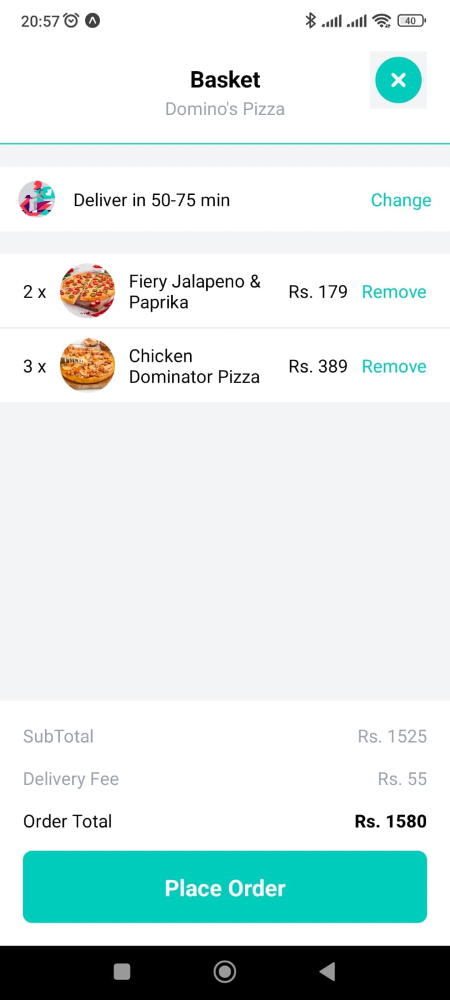
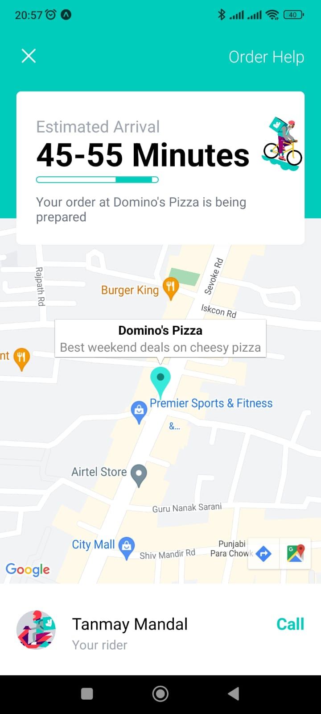

# Deliveroo Clone using React Native

This project is a Deliveroo clone built using React Native. It replicates the core functionality of the popular food delivery app, allowing users to browse restaurants, view their menus, add items to the cart, and place orders.

## Table of Contents

- [Introduction](#introduction)
- [Features](#features)
- [Installation](#installation)
- [Usage](#usage)
- [Screenshots](#screenshots)

## Introduction

The Deliveroo Clone is a mobile application that serves as a platform for users to order food from nearby restaurants. It aims to provide a seamless and user-friendly experience for ordering food online, making it easier for users to browse through various restaurants and place their desired orders.

## Features

- **Browse Restaurants**: Users can explore a list of nearby restaurants with information such as cuisine type, ratings, and delivery time.
- **Restaurant Menu**: Each restaurant displays its menu with categories, item details, and prices.
- **Add to Cart**: Users can select items from the menu and add them to their shopping cart.
- **Order Placement**: Users can review their cart, specify delivery details, and place the order.

## Installation

To run the application locally, follow these steps:

1. Clone this repository to your local machine.
2. Navigate to the project directory.
3. Install dependencies using `npm install` or `yarn install`.

## Usage

Before running the app, make sure you have a suitable development environment set up (Android Studio for Android, Xcode for iOS). Then, follow these steps:

- For Android &  iOS:
  1. Connect your Android device or emulator.
  2. Run `npx expo start` to start the app.

## Screenshots

  
  
  
  
  
  

Thank you for checking out the Deliveroo Clone project. If you have any questions or feedback, please feel free to contact us. Happy coding!
